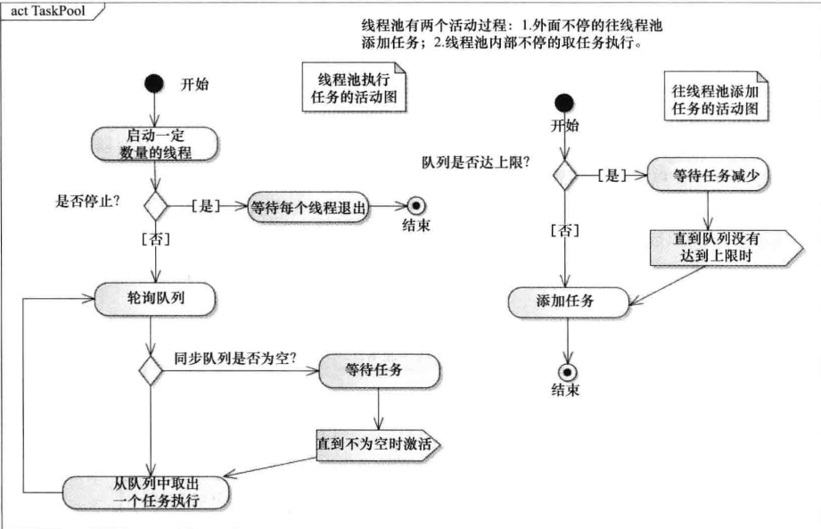

### 语言 : 
- c++ 11 or above.
### 涉及的c++11 特性 ：
- std::mutex
- std::thread
- std::list
- std::vector
- std::condition_variable
- std::queue
### 介绍：
- 线程池技术通过在系统中预先创建一定数量的线程，当任务请求到来时从线程池中分配一个预先创建的线程去处理任务，线程在处理完任务之后可以重用，不会销毁，而是等待下次任务的到来。这样，通过线程池能避免大量的线程创建和销毁动作，从而节省系统资源。对于多核处理器，由于线程会被分配到多个CPU，会提高并行处理的效率。并且每个线程独立阻塞，可以防止主线程被阻塞而是主流程被阻塞，导致其他请求得不到响应。

### 半同步半异步活动图

